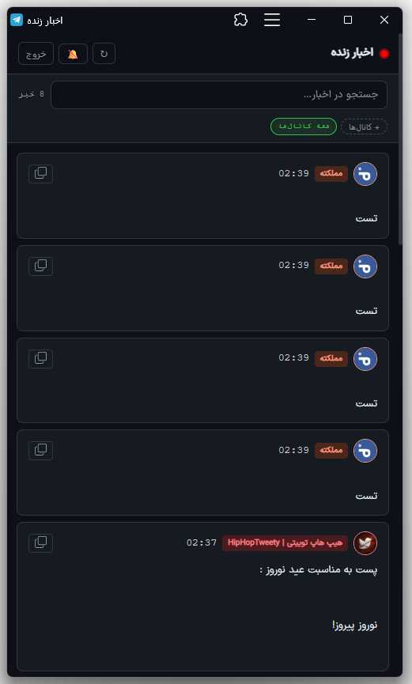

# 📡 TelegramLive — Telegram News Aggregator

A self-hosted, real-time news aggregator that monitors selected Telegram channels and broadcasts their posts to a live web feed — accessible to anyone without a Telegram account or VPN.

Built for people who need to share Telegram channel news with friends or audiences who have **restricted internet access**.

---

## 📸 Screenshots

> **Live Feed — `news.php`**

| Feed View |
|-----------|
|  |

> Place your screenshots in a `screenshots/` folder in the repo root.

---

## 📱 Install as an App (PWA)

`news.php` is a fully installable **Progressive Web App**. Viewers can add it to their phone's home screen and use it exactly like a native app — no app store needed.

**Android (Chrome / Edge):**
> Open the page → tap the **⋮ menu** → **"Add to Home screen"** → Install

**iPhone / iPad (Safari):**
> Open the page → tap the **Share button** (□↑) → **"Add to Home Screen"** → Add

**Desktop (Chrome / Edge):**
> Look for the **install icon** (⊕) in the address bar → click it → Install

Once installed, the app opens in fullscreen, works offline when there's no connection, and shows browser push notifications for new posts (if the user allows them).

> ℹ️ PWA install requires the site to be served over **HTTPS**.

---

## ✨ Features

- 🔴 **Live feed** — polls Telegram every 20 seconds and pushes new posts instantly
- 🖼️ **Text + images** — caption posts arrive with their image attached
- 🔐 **Encrypted storage** — news text is stored with AES-256-CBC encryption
- 📱 **PWA-ready** — installable on any device's home screen
- 🔔 **Browser notifications** — opt-in push alerts for new posts
- 🌐 **No Telegram needed** — viewers only need a browser
- 🧹 **Auto-cleanup** — entries older than N hours are deleted automatically
- 🔍 **Search + channel filter** — filter by channel or search keywords
- 🌙 **Dark UI** — RTL-ready, Persian/Farsi-first design

---

## 🏗️ Architecture

```
┌─────────────────────────────────────────────────────────────────┐
│                     GRABBER SERVER (Python)                      │
│                                                                  │
│   ┌────────────┐    SOCKS5     ┌───────────────────────────┐    │
│   │  Telegram  │◄─────────────│   news_grabber.py  v6.3   │    │
│   │  Channels  │   Telethon   │                           │    │
│   └────────────┘              │  Phase 1: Catch up on     │    │
│                               │    last message/channel   │    │
│                               │  Phase 2: Live poll       │    │
│                               │    every 20s              │    │
│                               │                           │    │
│                               │  profile_grabber.py       │    │
│                               │    (optional, one-shot)   │    │
│                               │                           │    │
│                               │  config.py  ← edit this   │    │
│                               └────────────┬──────────────┘    │
└────────────────────────────────────────────┼────────────────────┘
                                             │
                           HTTPS POST (JSON + base64 image)
                           { secret, channel, msg_id,
                             date, text, image? }
                                             │
┌────────────────────────────────────────────▼────────────────────┐
│                       WEB SERVER (PHP)                           │
│                                                                  │
│   ┌──────────────────────────────────────────────────────────┐  │
│   │  fetch.php  v5  — Receiver                               │  │
│   │  • Validates secret                                      │  │
│   │  • Rejects posts older than KEEP_HOURS                   │  │
│   │  • Saves image to /images/                               │  │
│   │  • AES-encrypts text → stores in SQLite (news.db)        │  │
│   │  • Periodic cleanup of old rows + image files            │  │
│   └──────────────────────────────────────────────────────────┘  │
│                                                                  │
│   ┌──────────────────────────────────────────────────────────┐  │
│   │  news.php  v7  — Live Feed (PWA)                         │  │
│   │  GET  news.php          → Full HTML page (PWA shell)     │  │
│   │  GET  news.php?api=1    → JSON: entries + stats          │  │
│   │  • Decrypts text on the fly                              │  │
│   │  • Returns newest-first, across all channels             │  │
│   │  • Browser polls every 2s (POLL_MS)                      │  │
│   └──────────────────────────────────────────────────────────┘  │
│                                                                  │
│   manifest.php — PWA manifest                                    │
│   sw.js        — Service Worker (offline cache)                  │
│   /images/     — Post images (auto-purged)                       │
│   /logos/      — Channel profile pictures                        │
│   news.db      — SQLite database                                 │
└─────────────────────────────────────────────────────────────────┘
                                  ▲
                        viewers open news.php in any browser
                     (no Telegram, no VPN, no app store needed)
```

### Data flow in detail

| Step | What happens |
|------|-------------|
| 1 | `news_grabber.py` reads `config.py` and connects to Telegram via SOCKS5 using Telethon |
| 2 | **Phase 1** — fetches the last relevant message from every configured channel |
| 3 | **Phase 2** — polls every 20 s for new messages |
| 4 | Text posts are pushed to `fetch.php` immediately |
| 5 | Image posts: image is downloaded first, then text + base64 image are pushed together |
| 6 | `fetch.php` validates the secret, encrypts the text, saves image, inserts into SQLite |
| 7 | Browser polls `news.php?api=1` every 2 s and inserts new cards into the DOM |

---

## 📁 File Structure

```
github/
├── README.md
├── README.fa.md
│
├── tg_grabber/                 ← runs on your Python server
│   ├── config.py               ← ✏️  ALL settings live here — edit this first
│   ├── news_grabber.py         ← main grabber (v6.3)
│   ├── profile_grabber.py      ← one-shot: downloads channel logos
│   ├── session.session         ← Telethon auth (auto-created, add to .gitignore)
│   ├── grabber.log             ← runtime log
│   ├── bandwidth.log           ← per-session bandwidth stats
│   ├── grabber.pid             ← lock file (prevents double-run)
│   └── images/                 ← local image cache (temp)
│
└── web/                        ← deployed on your PHP web host
    ├── news.php                ← live feed frontend + API
    ├── fetch.php               ← POST receiver from grabber
    ├── manifest.php            ← PWA manifest
    ├── sw.js                   ← Service Worker
    ├── Vazirmatn-Regular.woff2 ← Persian web font
    ├── icon-192.png            ← PWA icon (you provide)
    ├── icon-512.png            ← PWA icon (you provide)
    ├── news.db                 ← SQLite database (auto-created)
    ├── images/                 ← post images (auto-managed)
    └── logos/                  ← channel logo images (you provide)
        ├── channelhandle.jpg
        └── ...
```

---

## ⚙️ Setup Guide

### Prerequisites

| Component | Requirement |
|-----------|------------|
| Grabber server | Python **3.9+** |
| Web host | PHP **8.0+**, SQLite3 enabled, `openssl` extension |
| Telegram | An existing Telegram account to read public channels |
| (Optional) | SOCKS5 proxy, if your server can't reach Telegram directly |

---

### Part 1 — Web Server (PHP)

#### 1.1 Upload files

Upload the contents of `web/` to your host, e.g. into `/public_html/news/`.

#### 1.2 Set permissions

```bash
chmod 755 /public_html/news/
chmod 644 /public_html/news/*.php /public_html/news/sw.js
mkdir -p /public_html/news/images /public_html/news/logos
chmod 755 /public_html/news/images /public_html/news/logos
```

SQLite will create `news.db` automatically — the web directory must be **writable** by PHP.

#### 1.3 Configure `fetch.php`

```php
define('SECRET',   'your-long-random-secret');   // must match config.py
define('ENC_KEY',  'your-encryption-key');        // must match news.php
define('ENC_SALT', 'your-encryption-salt');       // must match news.php
define('KEEP_HOURS', 6);
```

#### 1.4 Configure `news.php`

```php
define('ENC_KEY',      'your-encryption-key');    // same as fetch.php
define('ENC_SALT',     'your-encryption-salt');   // same as fetch.php
define('PASS_KEY',     'your-viewer-password');   // optional access PIN
define('POLL_MS',      2000);
define('HOURS_WINDOW', 1);
```

Update `$CHANNEL_NAMES` to match your channel list.

#### 1.5 Add channel logos (optional)

```
web/logos/iranintltv.jpg
web/logos/vahidheadline.png
```

Any `.jpg .jpeg .png .webp .gif` is accepted. Falls back to a coloured initial circle if missing.

#### 1.6 Add PWA icons

Provide `icon-192.png` and `icon-512.png` in the `web/` folder.

---

### Part 2 — Grabber Server (Python)

#### 2.1 Python version

```bash
python3 --version   # must be 3.9 or higher
```

#### 2.2 Install dependencies

```bash
pip install telethon aiohttp pytz "python-socks[asyncio]" pillow psutil
```

| Package | Purpose |
|---------|---------|
| `telethon` | Telegram MTProto client |
| `aiohttp` | Async HTTP — POSTs to `fetch.php` |
| `pytz` | Timezone conversion (UTC → Tehran) |
| `python-socks[asyncio]` | SOCKS5 proxy support |
| `pillow` | Image processing for photo downloads |
| `psutil` | PID check for the lock-file guard |

> **Virtual environment (recommended):**
> ```bash
> python3 -m venv venv
> source venv/bin/activate        # Linux / macOS
> venv\Scripts\activate.bat       # Windows
> pip install telethon aiohttp pytz "python-socks[asyncio]" pillow psutil
> ```

#### 2.3 Get Telegram API credentials

1. Go to [https://my.telegram.org](https://my.telegram.org)
2. Click **"API development tools"** → create an app
3. Copy `api_id` and `api_hash`

#### 2.4 Edit `config.py`

Open `tg_grabber/config.py` and fill in **every section**:

```python
# ── Credentials ───────────────────────────────────────────────
API_ID   = 'YOUR_API_ID'
API_HASH = 'YOUR_API_HASH'
PHONE    = '+98912XXXXXXX'

# ── Proxy (set USE_PROXY = False if not needed) ───────────────
USE_PROXY  = True
PROXY_HOST = '127.0.0.1'
PROXY_PORT = 1071

# ── Channels ──────────────────────────────────────────────────
CHANNELS = ['channel1', 'channel2', ...]

# ── Push destination ──────────────────────────────────────────
PUSH_ENDPOINTS = [
    {'url': 'https://yoursite.com/news/fetch.php', 'secret': 'your-secret'},
]
```

#### 2.5 First run — Telegram authentication

```bash
cd tg_grabber
python3 news_grabber.py
```

First run will ask for your phone number and a verification code from Telegram. This creates `session.session`. All future runs reuse it silently.

> ⚠️ **Never commit `session.session` to Git.**

#### 2.6 Keep it running

**Linux — systemd:**

```ini
# /etc/systemd/system/tgrabber.service
[Unit]
Description=Telegram News Grabber
After=network.target

[Service]
WorkingDirectory=/opt/tgrabber
ExecStart=/usr/bin/python3 news_grabber.py
Restart=on-failure
RestartSec=10

[Install]
WantedBy=multi-user.target
```

```bash
sudo systemctl enable --now tgrabber
sudo journalctl -u tgrabber -f
```

**Linux — screen:**
```bash
screen -S grabber
python3 news_grabber.py
# Ctrl+A, D to detach
```

**Windows:**
```batch
start /B pythonw news_grabber.py
```

---

### Part 3 — Channel Logos (optional, one-shot)

```bash
cd tg_grabber
python3 profile_grabber.py
# → saves to profile_channels/
# Upload: profile_channels/*.jpg  →  web/logos/
```

---

## 🔑 Security

### ⚠️ Sensitive data — remove before pushing to GitHub

Your Python files may contain real credentials. **Check and replace all of these before committing:**

| File | Variable | What it is |
|------|----------|------------|
| `config.py` | `API_ID` | Your Telegram app ID — treat like a password |
| `config.py` | `API_HASH` | Your Telegram app secret — treat like a password |
| `config.py` | `PHONE` | Your personal phone number |
| `config.py` | `PUSH_ENDPOINTS[*].secret` | Your server's shared secret |
| `fetch.php` | `SECRET` | Must match the above |
| `news.php` | `ENC_KEY` / `ENC_SALT` | Encryption keys for stored news |

Replace them with placeholder strings like `'YOUR_API_ID'` before publishing.

### `.gitignore` — add this to your repo root

```gitignore
# Telegram session — grants full read access to your account
session.session

# Runtime files
grabber.pid
grabber.log
bandwidth.log
profile_grabber.log

# Local image cache
images/
profile_channels/
```

### Other notes

- Protect `news.db` from direct HTTP access via `.htaccess`:
  ```apache
  <Files "news.db">
      Require all denied
  </Files>
  ```
- Rate-limit `fetch.php` at the nginx/Apache level to prevent abuse.
- HTTPS is required for the PWA install prompt and service worker to work.

---

## ⚡ Quick Checklist

```
[ ] config.py      — API_ID, API_HASH, PHONE, CHANNELS, PUSH_ENDPOINTS filled in
[ ] fetch.php      — SECRET, ENC_KEY, ENC_SALT set
[ ] news.php       — ENC_KEY, ENC_SALT match fetch.php
[ ] Web server     — images/ and logos/ are writable
[ ] Web server     — HTTPS enabled
[ ] PWA icons      — icon-192.png and icon-512.png in web/
[ ] .gitignore     — session.session excluded
[ ] GitHub         — no real API_ID, API_HASH, or PHONE committed
```

---

## 📄 License

MIT — free to use, modify, and self-host.
